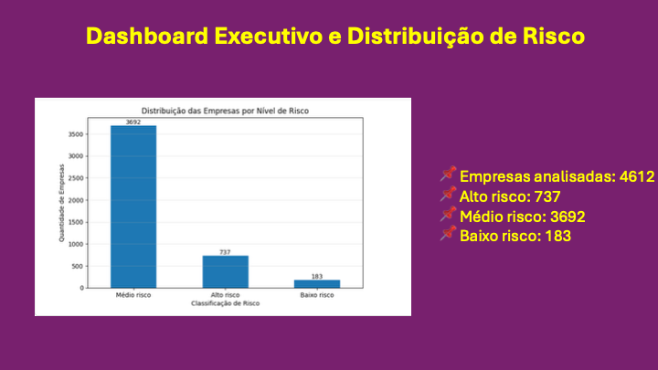

# TokenReceiv – Risk Analysis Platform

## Overview
This project was developed to support receivables risk analysis using financial and liquidity indicators.

The notebook applies data analysis techniques with Python and Pandas to calculate a custom risk score for companies based on:
- Liquidity indicators
- Payment delay history
- Materiality score
- Financial behavior metrics

## Technologies Used
- Python
- Pandas
- Jupyter Notebook

## Features
- Data loading and preprocessing
- Financial risk score calculation
- Exploratory data analysis
- Risk indicator evaluation

## Project Structure
## Risk Dashboard

